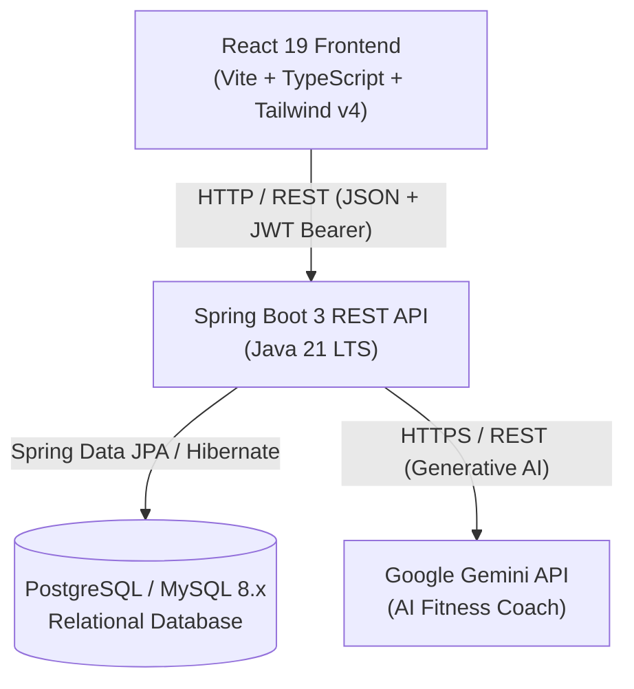

# ForgeFit - System Architecture & Technical Specifications

This document outlines the technical architecture, data flows, communication protocols, and design patterns for the **ForgeFit** application.

---

## 1. High-Level System Architecture



---

## 2. Backend Architecture (`forgefit-server`)

The backend is built with **Spring Boot 3** and **Java 21**, following the strict **Layered Architecture** pattern.

### 2.1 Package Organization

```text
com.forgefit.server/
├── config/                  # App configurations (Security, CORS, Jackson, Swagger/OpenAPI)
├── controllers/             # REST Endpoints (HTTP routing, validation, response envelopes)
├── dto/                     # Data Transfer Objects
│   ├── request/             # Incoming payloads (*Request.java)
│   └── response/            # Outgoing payloads (*Response.java)
├── entities/                # JPA Database Entities (@Entity, @Table, @Id)
├── exceptions/              # Custom domain exceptions & GlobalExceptionHandler
├── mappers/                 # Conversion between Entities and DTOs (e.g. MapStruct or Manual)
├── repositories/            # Spring Data JPA interfaces extending JpaRepository
├── security/                # JWT Token Provider, Auth Filter, Custom UserDetailsService
└── services/                # Business logic contracts and implementations
    └── impl/                # Service implementations (@Service, @Transactional)
```

### 2.2 Layer Responsibilities & Rules

| Layer | Responsibility | Forbidden Actions |
| :--- | :--- | :--- |
| **Controller** | Parse incoming JSON, trigger `@Valid`, call Service method, return `ResponseEntity<ApiResponse<T>>`. | **No** business logic. **No** direct database calls. **No** entity exposure. |
| **Service** | Core business logic, transaction management (`@Transactional`), domain validation, calculations (MET, XP). | **No** HTTP-specific objects (`HttpServletRequest`, status codes). |
| **Repository** | Data persistence via Spring Data JPA and JPQL. | **No** business logic or DTO transformations. |
| **Entity** | Maps database tables, columns, foreign keys, and indexes. | **Never** returned directly in Controller responses. |
| **DTO** | Immutable data contracts (Java Records) for API boundaries. | **No** database annotations (`@Entity`, `@Table`). |

### 2.3 Standard API Response Envelopes

All REST endpoints return standardized JSON structures:

#### Success Response Envelope (`ApiResponse<T>`):
```json
{
  "success": true,
  "message": "Workout session logged successfully",
  "data": {
    "id": 14,
    "exerciseName": "Bench Press",
    "totalCaloriesBurned": 182.5,
    "xpEarned": 50,
    "loggedAt": "2026-09-21T11:55:00Z"
  },
  "timestamp": "2026-09-21T11:55:01Z"
}
```

#### Error Response Envelope (`ApiError`):
```json
{
  "success": false,
  "message": "Validation failed",
  "errors": [
    {
      "field": "weightKg",
      "rejectedValue": -5,
      "message": "Weight must be greater than 0"
    }
  ],
  "timestamp": "2026-09-21T11:55:01Z",
  "status": 400
}
```

### 2.4 Security & Authentication Flow

1. **Stateless JWT**: No server-side sessions (`SessionCreationPolicy.STATELESS`).
2. **Authentication Flow**:
   - `POST /api/auth/login`: Client sends email and password.
   - Server verifies credentials using `AuthenticationManager` and `BCryptPasswordEncoder`.
   - On success, server generates a cryptographically signed JWT containing:
     - `sub`: User email
     - `userId`: Database ID
     - `role`: `ROLE_USER` or `ROLE_ADMIN`
     - `exp`: Expiration timestamp (e.g., 24 hours)
   - Client stores JWT securely and sends it in the `Authorization: Bearer <token>` header for subsequent requests.
3. **Filter Chain**:
   - `JwtAuthenticationFilter` intercepts incoming requests, extracts the Bearer token, validates the signature, loads user authorities into `SecurityContextHolder`, and passes the request down the chain.

---

## 3. Frontend Architecture (`forgefit-client`)

The frontend is a Single Page Application (SPA) built with **React 19**, **TypeScript**, **Vite**, and **Tailwind CSS v4**.

### 3.1 Feature-Driven Modular Architecture

Instead of grouping by file type (all components in one folder, all hooks in another), code is grouped by **business domain**:

```text
src/
├── features/
│   ├── auth/
│   │   ├── components/      # LoginForm.tsx, RegisterForm.tsx
│   │   ├── hooks/           # useAuth.ts
│   │   ├── services/        # authService.ts (login, register, logout)
│   │   └── types/           # authTypes.ts
│   ├── workouts/
│   │   ├── components/      # WorkoutCard.tsx, SetLogger.tsx, ExerciseSelector.tsx
│   │   ├── hooks/           # useWorkouts.ts
│   │   ├── services/        # workoutService.ts
│   │   └── types/           # workoutTypes.ts
│   ├── meals/               # Meal logging & food search
│   ├── water/               # Hydration tracker
│   ├── chatbot/             # AI fitness coach chat interface
│   └── dashboard/           # User dashboard & XP progression
```

### 3.2 Centralized HTTP Client (`src/services/api.ts`)

- Preconfigured Axios instance with `baseURL: import.meta.env.VITE_API_BASE_URL`.
- **Request Interceptor**: Reads JWT token from storage and appends `Authorization: Bearer <token>` to headers.
- **Response Interceptor**: Intercepts `401 Unauthorized` responses globally, triggers session cleanup, and redirects the user to `/login`.

### 3.3 Routing & Guarded Layouts

- **Public Routes**: `/login`, `/register`, `/forgot-password` (wrapped in `AuthLayout`).
- **Protected User Routes**: `/dashboard`, `/workouts`, `/meals`, `/water`, `/chat`, `/profile` (guarded by `ProtectedRoute`, wrapped in `MainLayout` with Navbar and Sidebar).
- **Protected Admin Routes**: `/admin/dashboard`, `/admin/workouts`, `/admin/meals`, `/admin/users` (guarded by `AdminRoute`, wrapped in `AdminLayout`).

---

## 4. Database Architecture & Migrations

### 4.1 Normalized Relational Schema
Unlike the legacy PHP application which stored exercise sets as JSON blobs, the production database is strictly normalized:

- `users`: Core identity, credentials, role, status.
- `user_profiles`: Height, current weight, target weight, daily calorie goal, daily water goal.
- `exercises`: Exercise catalog with muscle groups, categories, and MET values.
- `workout_sessions`: Master record of a logged workout session (date, duration, total calories, notes).
- `workout_sets`: Normalized line items for each set (set number, reps, weight in kg).
- `food_items`: Nutrition catalog (calories, protein, carbs, fat, fiber per unit).
- `meal_logs`: Logged meals by date and slot (Breakfast, Lunch, Dinner, Snack).
- `water_logs`: Daily hydration glass counts and timestamps.
- `levels`: Gamification thresholds for XP and level progression.

### 4.2 Migration Strategy with Flyway
- Schema changes are managed via versioned migration scripts in `src/main/resources/db/migration/`.
- Naming convention: `V<Version>__<Description>.sql` (e.g., `V1__initial_schema.sql`, `V2__add_indexes.sql`).
- Hibernate is configured to validate the schema (`spring.jpa.hibernate.ddl-auto=validate`), never create or alter tables automatically in production.

---

## 5. External Integrations (AI Fitness Coach)

- **Provider**: Google Gemini API via Spring Boot backend service (`GeminiService.java`).
- **Security**: The client **never** interacts directly with Gemini; the API key is secured on the backend.
- **Context Injection**: When a user messages the AI Coach, the backend injects the user's recent activity context (calories logged today, workouts completed, hydration progress) into the system prompt to provide tailored fitness and nutritional guidance.
